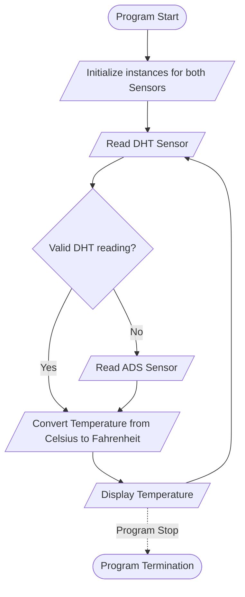

```mermaid
flowchart TD

start([Program Start])
A1[/"Initialize instances for both Sensors"/]
A2[/"Read DHT Sensor"/]
D1{Valid DHT reading?}
A3[/"Convert Temperature from Celsius to Fahrenheit"/]
A4[/"Read ADS Sensor"/]
A5[/"Display Temperature"/]
stop([Program Termination])


%% chart Connections
start --> A1
A1 --> A2
A2 --> D1
D1 -- Yes --> A3
D1 -- No --> A4
A4 --> A3
A3--> A5
A5 --> A2
A5 -. Program Stop .-> stop


```
