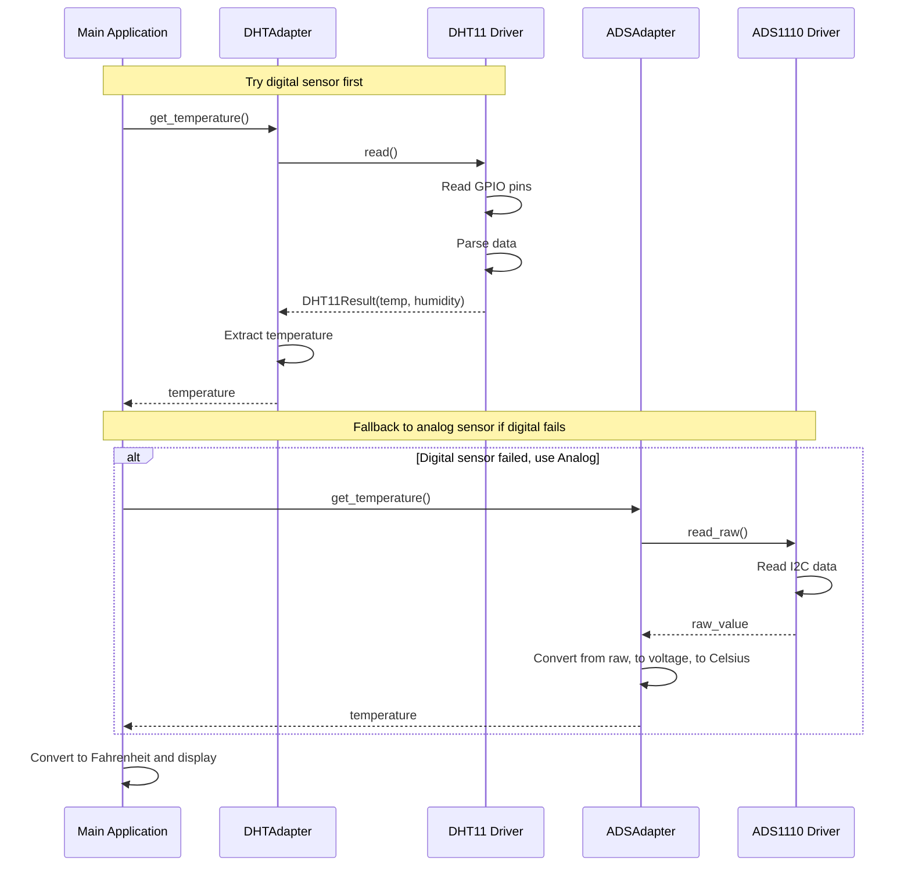

```mermaid
sequenceDiagram
    %% PARTICIPANTS
    participant Main as Main Application
    participant DHTAdapter as DHTAdapter
    participant DHT11 as DHT11 Driver
    participant ADSAdapter as ADSAdapter
    participant ADS1110 as ADS1110 Driver


    %% Defualt block with digital sensor first (arrow connections)
   Note over Main,DHT11: Try digital sensor first
    Main->>DHTAdapter: get_temperature()
    DHTAdapter->>DHT11: read()
    DHT11->>DHT11: Read GPIO pins
    DHT11->>DHT11: Parse data
    DHT11-->>DHTAdapter: DHT11Result(temp, humidity)
    DHTAdapter->>DHTAdapter: Extract temperature
    DHTAdapter-->>Main: temperature

    %% ALT block or else digital sensor fails
    Note over Main,ADS1110: Fallback to analog sensor if digital fails
    alt Digital sensor failed, use Analog
        Main->>ADSAdapter: get_temperature()
        ADSAdapter->>ADS1110: read_raw()
        ADS1110->>ADS1110: Read I2C data
        ADS1110-->>ADSAdapter: raw_value
        ADSAdapter->>ADSAdapter: Convert from raw, to voltage, to Celsius
        ADSAdapter-->>Main: temperature
    end

    %% I beleive this is outside of alt block, so both ADS and DHT hit this to convert to Fahrenheit
    Main->>Main: Convert to Fahrenheit and display

```
