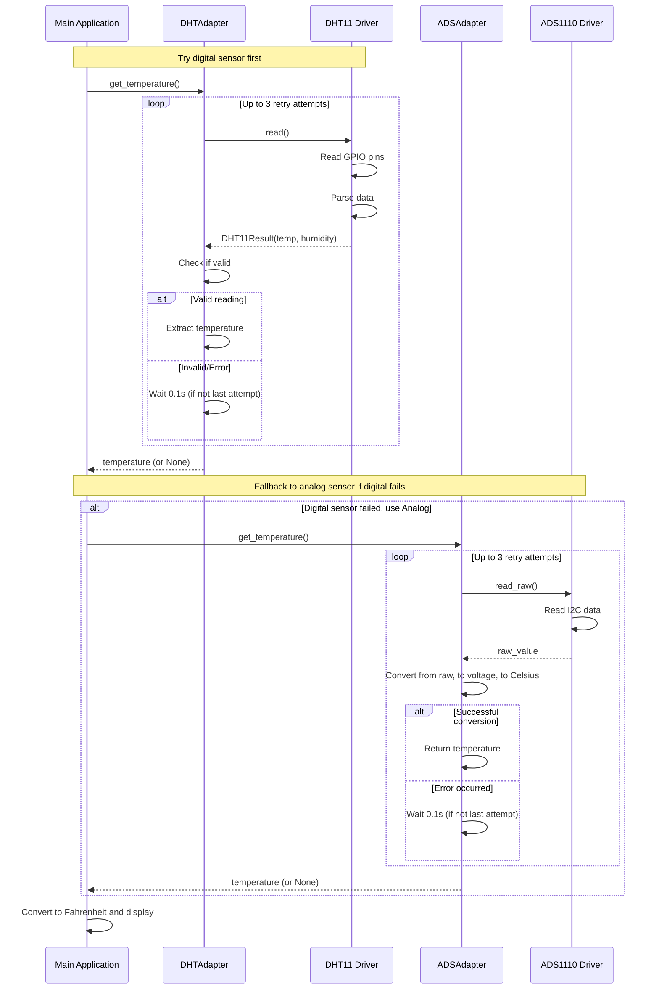

```mermaid
sequenceDiagram
    %% PARTICIPANTS
    participant Main as Main Application
    participant DHTAdapter as DHTAdapter
    participant DHT11 as DHT11 Driver
    participant ADSAdapter as ADSAdapter
    participant ADS1110 as ADS1110 Driver


    %% Default block with digital sensor first (arrow connections)
   Note over Main,DHT11: Try digital sensor first
    Main->>DHTAdapter: get_temperature()

    loop Up to 3 retry attempts
        DHTAdapter->>DHT11: read()
        DHT11->>DHT11: Read GPIO pins
        DHT11->>DHT11: Parse data
        DHT11-->>DHTAdapter: DHT11Result(temp, humidity)
        DHTAdapter->>DHTAdapter: Check if valid
        alt Valid reading
            DHTAdapter->>DHTAdapter: Extract temperature
        else Invalid/Error
            DHTAdapter->>DHTAdapter: Wait 0.1s (if not last attempt)
        end
    end

    DHTAdapter-->>Main: temperature (or None)

    %% ALT block or else digital sensor fails
    Note over Main,ADS1110: Fallback to analog sensor if digital fails
    alt Digital sensor failed, use Analog
        Main->>ADSAdapter: get_temperature()

        loop Up to 3 retry attempts
            ADSAdapter->>ADS1110: read_raw()
            ADS1110->>ADS1110: Read I2C data
            ADS1110-->>ADSAdapter: raw_value
            ADSAdapter->>ADSAdapter: Convert from raw, to voltage, to Celsius
            alt Successful conversion
                ADSAdapter->>ADSAdapter: Return temperature
            else Error occurred
                ADSAdapter->>ADSAdapter: Wait 0.1s (if not last attempt)
            end
        end

        ADSAdapter-->>Main: temperature (or None)
    end

    %% I believe this is outside of alt block, so both ADS and DHT hit this to convert to Fahrenheit
    Main->>Main: Convert to Fahrenheit and display
```
