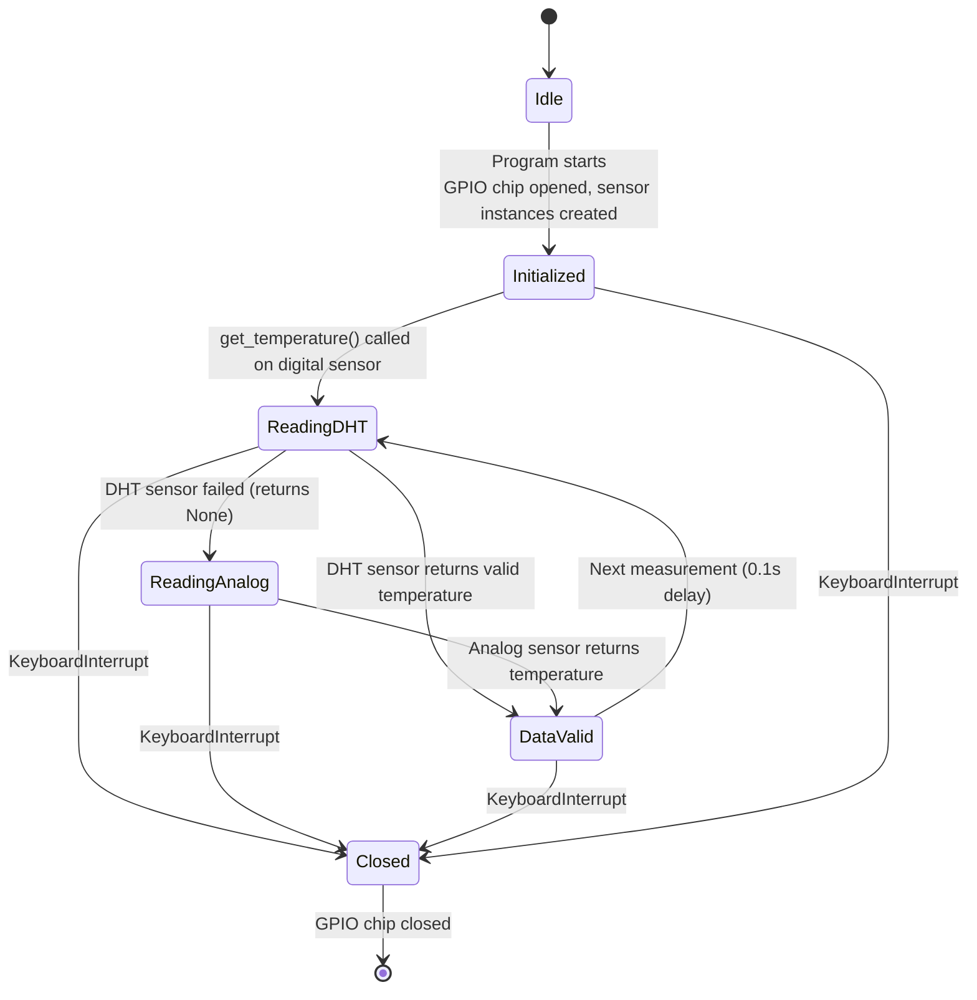

```mermaid
stateDiagram-v2
    [*] --> Idle

    Idle --> Initialized : Program starts<br/>GPIO chip opened, sensor instances created

    %% First we try to read DHT sensor
    Initialized --> ReadingDHT : get_temperature() called on digital sensor

    %% If that sensor reading == NONE, then we result to Analog sensor
    ReadingDHT --> DataValid : DHT sensor returns valid temperature

    %% DHT reading == NONE
    ReadingDHT --> ReadingAnalog : DHT sensor failed (returns None)

    %% Analog Sensor gets a reading (we assume correct)
    ReadingAnalog --> DataValid : Analog sensor returns temperature

    %% Each tempture reading in Loop will first try to be from DHT sensor
    DataValid --> ReadingDHT : Next measurement (0.1s delay)

    %% So because all the sensor reading happens in a True loop, KeyboardInterrupt could happen at any step

    ReadingDHT --> Closed : KeyboardInterrupt

    ReadingAnalog --> Closed : KeyboardInterrupt

    DataValid --> Closed : KeyboardInterrupt

    Initialized --> Closed : KeyboardInterrupt

    Closed --> [*] : GPIO chip closed

```
