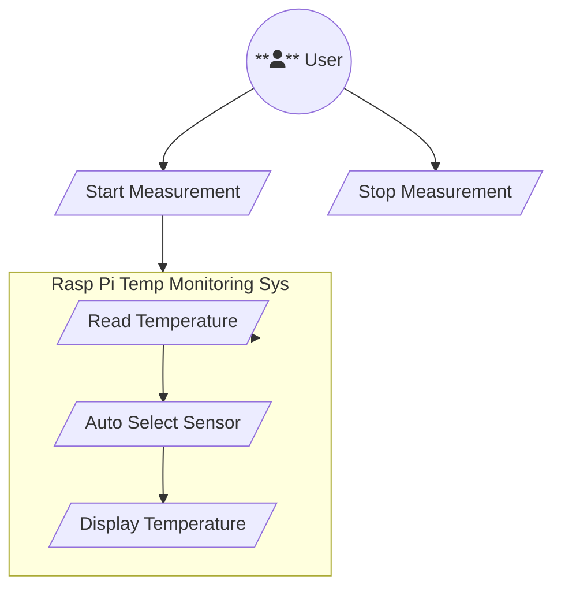

```mermaid
flowchart TD
    USER(("**fa:fa-user** User"))

    subgraph SYS["Rasp Pi Temp Monitoring Sys"]
        UC1[/"Read Temperature"/]
        UC2[/"Auto Select Sensor "/]
        UC3[/"Display Temperature"/]

    end
    UC0[/"Start Measurement"/]
    UC4[/"Stop Measurement"/]

    %% Relations
    USER --> UC0
    UC0 --> SYS
    SYS --> UC1
    UC1 --> UC2
    UC2 --> UC3
    USER --> UC4
```
