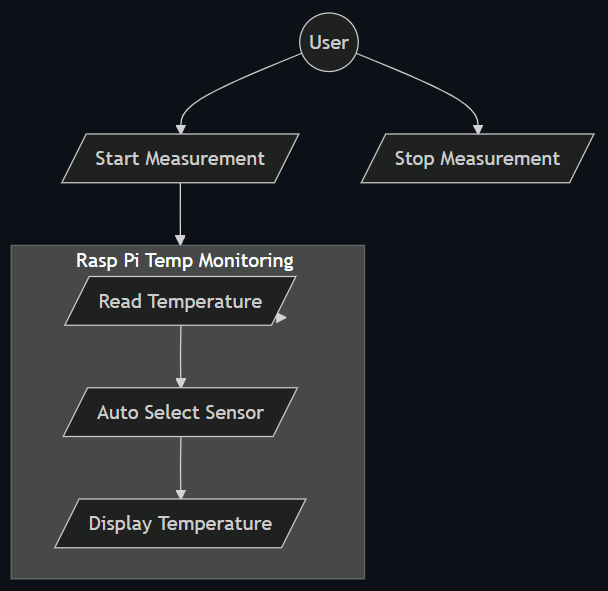
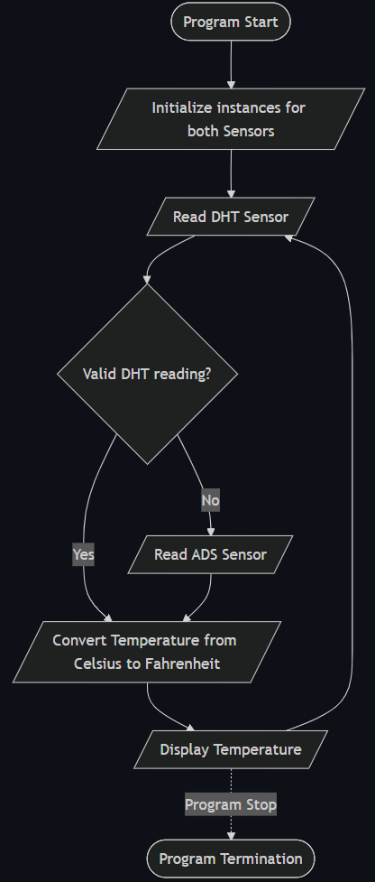
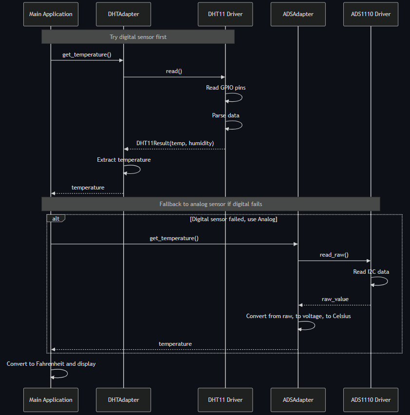
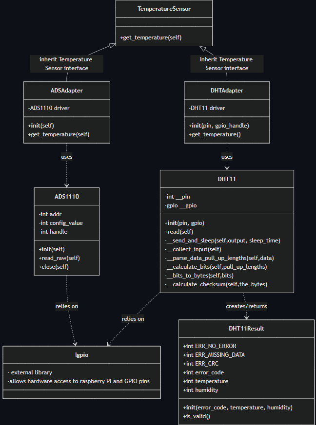
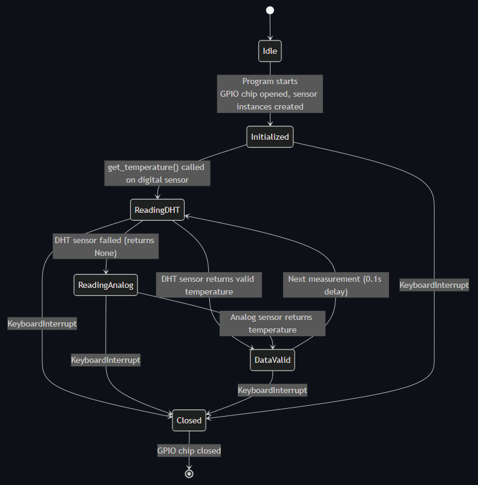

# 427 Project 1 - Hardware Abstraction with Adapter Pattern

## System Overview

This system takes the temperature reading from either a digital temperature sensor or an analog temperature sensor, or both, and displays a single syncronized result.

- This solves the problem that multiple sensors create, as two different results needs to be translated differently, but this system can read both.
- Supported sensors include: ADS1110, DHT11.
- The design uses an adapter pattern to check for inputs from each type of sensor in case one is attached instead of the other. It also can swap to a secondary sensor in the case that one malfunctions.
- The client of the system is whomever receives the synced temperature reading from the adapter pattern.

## UML Diagrams

### Use Case Diagram

### Activity Diagram

### Sequence Diagram

### Class Diagram

### State Diagram

## Robustness Improvement Discussion

In a scenario where a sensor read operation fails, instead of a reported failure with a swap to another available sensor, the system should:

- Retry the read operation up to 3 times,
- Wait a short time between retries, and
- Only report failure if all retries fail.

Discussion:

At first glance, I thought the fix should go inside of main, as that is where we manually manage which sensor to use. However, after further thinking, the `main.py` file should not be aware of the sensor failing and implement retry logic. `main.py`'s only job is to recive data and display it. If we added the retry logic there, it would be a "patch" that covers up the issue, not prevents it. Furthermore if the logic was implemented inside the drivers.py files, that would not be smart as those files are supposed to be low level, read the sensors and report.

The logic is now implemented inside of the adapter class, or `adapters.py`. The entire point of the adapter classes is to provide an interface to work with the old code and new code. Each sensor now retrys up to three times in the `get_temperature()` function

## Reflection
